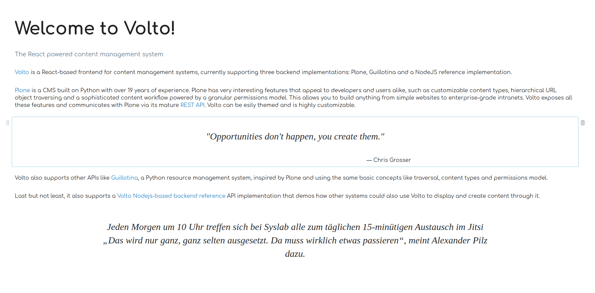

## Preview


## Use in Volto

i) update main/mrs.developer.json
```bash
{
     "volto-download-block": {
         "url": "git@github.com:itonboard/volto-quote-block.git",
         "path": "src",
         "package": "@itonboard/volto-quote-block",
         "branch": "master"
     }
}
```

ii) run yarn develop (adds path in main/jsconfig.json if not already configured)
```bash
yarn develop
```
iii) edit main/package.json ("private": "true" needs to be true)
```bash
  ...
  "private": true,
  "workspaces": [
    "src/addons/volto-quote-block"
  ],
  "addons": [
    ...
    "@itonboard/volto-quote-block"
  ]
```
